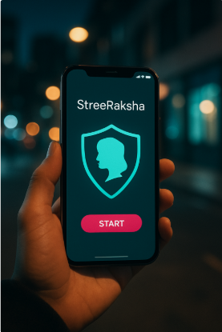

<!-- Animated Header -->
<h1 align="center">
  
</h1>

  <em>Curiosity meets code – exploring AI, ML, and real-world problem solving 🚀</em>

---

## 💡 About Me  

🎓 **Computer Science (AI & ML)** undergraduate at ATME College of Engineering, Mysore  
💻 Passionate about **AI, Machine Learning, and Scalable Software Development**  
🤝 Active **open-source contributor** and **community collaborator**  
🎯 Strong believer in building **impact-driven technology**  
📫 Reach me at: [LinkedIn](https://www.linkedin.com/in/amruta-salagare-3a171325b/) | [Email](mailto:amrutasalagare2609@gmail.com)  

--- 

## 🛠 Tech Toolbox  

  
  
  
  
  
  
  
  
  
  
  
  
  
  
  
  

---

## 🌟 Featured Projects  

  
  
  

---

## 📊 GitHub Stats  

  
  

---

## 🏆 Achievements & Leadership  

- 🏅 **Runner-up** – Code Battle 2K24  
- 🎤 **Hackathon Organizer** – Tech Avishkar 2.0 (200+ participants)  
- 📌 **Program Head** – IEEE Student Branch Chapter, ATMECE  
- 🎯 **Stage Committee Head** – IET on Campus, ATMECE  

---

## 📈 Activity Graph  

  

---

## ✨ Fun Fact  

I believe every **line of code** has the potential to make someone's life easier – and I’m here to write those lines.  

---

  

